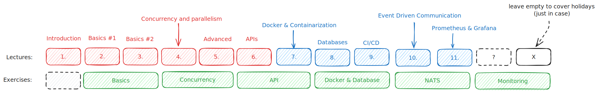

# Course schedule

> [!WARNING]
> The course is currently a WIP! \
> None of the things stated here are final.

## Outline

## Lectures

1. Introduction
    - Course syllabus & requirements
    - History of Go
    - Putting Go into context
    - Why learn it
    - Comparison with other languages
    - Where is it used
    - Installation
        - Environment setup
    - Tooling
        - IDEs
2. Basics #1
    - Keywords
    - Data types
    - Operators
    - Variables
    - Pointers
    - Visibility
    - Packages
    - Control flow
    - Functions
        - Anonymous & Closures
        - Defer
    - Structures
3. Basics #2
    - Interfaces
    - Errors
        - Recover
    - Arrays
    - Slices
    - Maps
    - Range
    - Generics
    - Standard Library
        - os
        - io
        - strings
        - slices
        - sort
        - rand & crypto/rand
4. Concurrency and parallelism
    - Runtime
    - Goroutines
    - Channels
        - Buffering
        - Directions
    - Select
    - Contexts, Timers & Tickers
    - Synchronization primitives & atomics
    - Patterns
5. Advanced
    - Generics
    - Testing
    - Benchmarking
    - Optimations
        - pprof
        - runtime
    - CGO
    - Reflection
    - Debugging
        - delve
    - Makefiles/Magefiles
    - Configs
        - flags
        - Viper
    - Templates
6. Building APIs
    - REST
    - Http package
    - JSON
    - Marshalling/Unmarshalling
    - Gorrila/Chi/Fiber/Gin
    - OpenAPI Specification
    - GQL/gRPC
        - GQL Schema/Protocol Buffers
    - Auth
    - Air
7. Docker
    - Virtualization 
        - Containers & VMs
    - Docker engine
    - Docker basics
        - Images
        - Containers
        - Volumes
        - Networks
        - CLI usage
    - Dockerfile
    - YAML
    - Docker compose
    - Publishing images
    - Kubernetes
8. Databases
    - Storage types
        - SQL
            - SQLite
            - PostgresSQL
        - NoSQL
            - Redis
        - Object storage
            - Minio
    - Approaches
        - database/sql
        - pgx
        - sqlx
        - sqlc
        - GORM
    - Migrations
    - Caching
9. CI/CD
    - Project setup
    - Git, GitHub & GitLab
    - GitHub Actions
        - Workflows
        - Artifacts
        - Variables & Secrets
    - CI
        - Formatting
        - Lint
        - Test
        - Build
    - GCP
        - Artifact Registry
        - Cloud Run
    - CD
        - Upload
        - Deployment
    - Bots
    - Tags & Releases
    - Go Packages & Documentation
10. Event Driven Communication
    - Use cases and motivation
    - NATS, Kafka & RabbitMQ
    - Core NATS
    - JetStream
        - Streams
        - Key-value store
        - Object Store
    - Integration
11. Production
    - Health checks
    - Logging
        - log
        - slog
        - zerolog
    - CNCF
    - Monitoring
        - Prometheus
        - Grafana
    - Tracing
        - Jaeger
    - Proxying
        - Caddy
        - Traefik

## Assesment

- Completion of exercises
- Final project
    - Team
    - Solo
    - Open-source PR
